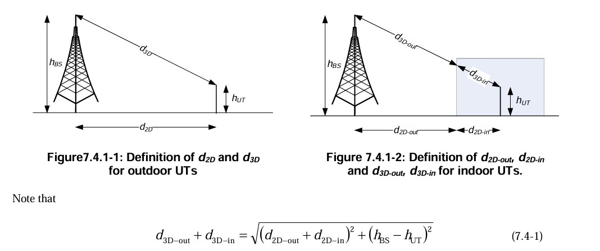
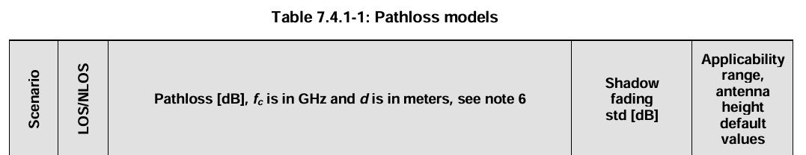
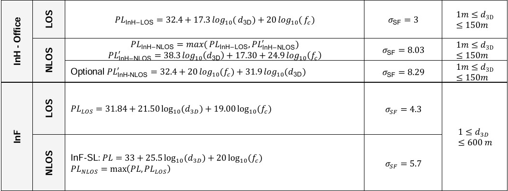
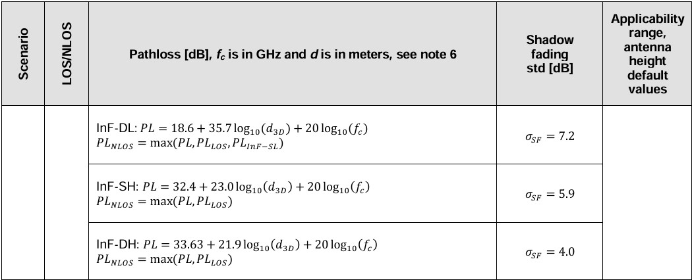
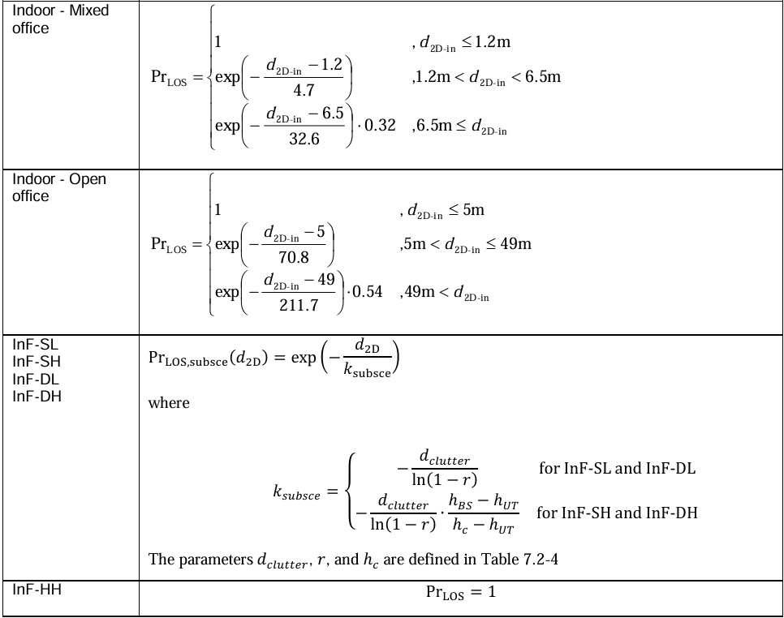

# 3GPP TR 38.901 V19.0.0 (2025-06)

## Escopo do documento

O documento tem como título "Study on channel 
model for frequêncy spectrum above 6 GHz" e trás à metodologia de avaliação
do 3GPP e modelagem de camada física tanto do equipamento móvel quanto da rede
de acesso.

O documento fala dos modelos de canal para frequências de 0,5 GHz a 100 GHz.

## Trabalhos de modelagem fora do 3GPP

### Grupos (Section 6.1)

- METIS (Mobile and wireless communications Enablers for the Twenty-twenty Information Society)
- MiWEBA (Millimetre-Wave Evolution for Backhaul and Access)
- ITU-R M
- COST2100
- IEEE 802.11
- NYU WIRELESS
- 5G mmWave Channel Model Alliance: NIST iniciated, Noth America based
- mmMAGIC (Millimetr-Wave Based Mobile Radio Access Network for Fifth Generation Integrated Communications: Europe based)
- IMT-2020 5G promotion assiciation: China based

### Modelos (Section 6.1)

#### METIS Channel Models:
 
  - Projeto acabou em 2017

#### MiWEBA Channel Models:

 - Abordou diversos desafios: sombreamento, consistência espacial, dinâmicas ambientais, modelagem de ondas esféricas, modelo Doppler de dupla mobilidade, razão entre reflexões difusas e especulares, polarização;
 - Proposed Quasi-deterministic channel model;
 - Performed channel measurements at 60 GHz;
 - Focused on university campus, street canyon, hotel lobby, backhaul, and D2D scenarios.

#### ITU-R M Channel Models:

- Addressed the propagation loss and atmospheric loss on mmW;
- Introduced enabling antenna array technology and semiconductor technology;
- Proposed deployment scenarios, focused on dense urban environment for high data rate service: indoor shopping 
mall, indoor enterprise, in home, urban hotspot in a square/street, mobility in city;

#### COST2100 and COST IC1004 Channel Models:

- Geometry-based stochastic channel model that reproduce the stochastic properties of MIMO channels over time, 
frequency and space. It is a cluster-level model where the statistics of the large scale parameters are always 
guaranteed in each series of channel instances.

### NYU WIRELESS Channel Models:

- Conducted many urban propagation measurements on 28/38/60/73 GHz bands for both outdoor and indoor 
channels, measurements are continuing.  
- Proposed 3 areas for 5G mmWave channel modelling which are small modifications or extensions from 3GPP's 
current below 6GHz channel models  
- LOS/NLOS/blockage modelling (a squared exponential term); 2). Wideband power delay profiles (time 
clusters and spatial lobes for a simple extension to the existing 3GPP SSCM model); 3). Physics-based path loss 
model (using the existing 3GPP path loss equations, but simply replacing the "floating" optimization parameter 
with a deterministic 1 m "close-in" free space reference term in order to provide a standard and stable definition 
of "path loss exponent" across all different parties, scenarios, and frequencies). 

### 802.11 ad/ay Channel Models:

- Conducted ray-tracing methodology on 60 GHz band indoor channels, including conference room, cubicle, 
living room scenarios 
- Intra cluster parameters were proposed in terms of ray excess delay and ray power distribution 
- Human blockage models were proposed in terms of blockage probability and blockage attenuation 

### 5G mmWave Channel Model Alliance:

- Will provide a venue to promote fundamental research into measurement, analysis, identification of physical 
parameters, and statistical representations of mmWave propagation channels.  
- Divided into six collaborative working groups that include a Steering Committee; Modelling Methodology 
Group; Measurement Methodology Group; and groups that focus on defining and parameterizing Indoor, 
Outdoor, and Emerging Usage Scenarios.  
- Sponsored by Communications Technology Research Laboratory within the NIST.

### mmMAGIC:

-Brings together major infrastructure vendors, major European operators, leading research institutes and 
universities, measurement equipment vendors and one SME.  
- Will undertake extensive radio channel measurements in the 6-100 GHz range. 
- Will develop and validate advanced channel models that will be used for rigorous validation and feasibility 
analysis of the proposed concepts and system, as well as for usage in regulatory and standards fora.

### IMT-2020 5G promotion association:

- Jointly established by three ministries of China based on the original IMT-Advanced promotion group 
- Members including the main operators, vendors, universities and research institutes in China 
- The major platform to promote 5G technology research in China and to facilitate international communication 
and cooperation 

### QuaDRiGa (Fraunhofer HHI) :

- QuaDRiGa (QUAsi Deterministic RadIo channel GenerAtor) was developed at the Fraunhofer Heinrich Hertz 
Institute within the Wireless Communications and Networks Department to enable the modelling of MIMO radio 
channels for specific network configurations, such as indoor, satellite or heterogeneous configurations. 
- Besides being a fully-fledged 3D geometry-based stochastic channel model (well aligned with TR36.873), 
QuaDRiGa contains a collection of features created in SCM(e) and WINNER channel models along with novel 
modelling approaches which provide features to enable quasi-deterministic multi-link tracking of users (receiver) 
movements in changing environments. QuaDRiGa supports Massive MIMO modelling enabled through a new 
multi-bounce scattering approach and spherical wave propagation. It will be continuously extended with features 
required by 5G and frequencies beyond 6 GHz. The QuaDRiGa model is supported by data from extensive 
channel measurement campaigns at 10 / 28 / 43 / 60 / 82 GHz performed by the same group.

### ATIS Next G Alliance:

- Published a report that includes a collection of results from several measurement campaigns relevant to 
deployment scenarios and use cases for 7-24 GHz channel modeling enhancements and channel modeling for 
integrated sensing and communications.

### ETSI Industry specification group (ISG) Integrated sensing and communications (ISAC):

- ETSI ISG ISAC plans to publish Group Report (GR) /ISC-002 that provides information on advanced ISAC 
channel modeling concepts and their validation through measurement, in addition to information on evaluation 
methodology framework, deployment scenarios and the corresponding potentially suitable frequency bands.

## Modelos de Canal para 0.5-100 GHz

### Cenários de Interesse (Section 6.2)

- UMi (Street Canyin, open area) com O2O (Outdoor-to-Outdoor) e O2I (Outdoor-to-Indoor)
  - Cenários da vida real, como uma cidade ou praça de estação. A largura da área aberta típica está na faixa de 
50 a 100 m.

- UMa with O2O e O2I:
  - Estações base estão montadas acima dos níveis dos telhados dos edifícios ao redor.

- **Indoor**
  - Ambientes de escritório, Shopping malls...
  - O ambiente típico de escritório é composto por áreas de cubículos abertos, escritórios fechados, áreas abertas, 
corredores, etc.

- Backhaul:
  
- D2D/V2V:

- Outros cenários, como Estádio (com telhado aberto) e Ginásio (com telhado fechado).

- Cenários industriais Indoor

- Suburban macro (SMa) scenarios

### Cenários (Section 7.2)

#### UMi-street canyon and UMa

#### Indoor-office

#### RMa

#### Indoor Factory (InF)

Foca em halls de fábricas de tamanhos variados e com diferentes níveis de densidade
de "bagunça", como máquinas, linhas de montagem, prateleiras de armazenamento, etc.
Os detalhes do cenário InF estão listados na Tabela 7.2-4.

#### SMa

### Pathloss, LOS probability and penetration modeling (Section 7.4)

#### Pathloss (Section 7.4.1)
Os modelos de perda de caminho possuem distribuição da desvanecimento de sombra é log-normal, e seu desvio 
padrão para cada cenário é fornecido na Tabela 7.4.1-1.

#### LOS probability (Section 7.4.2)

#### Fast fading model (Section 7.5)

