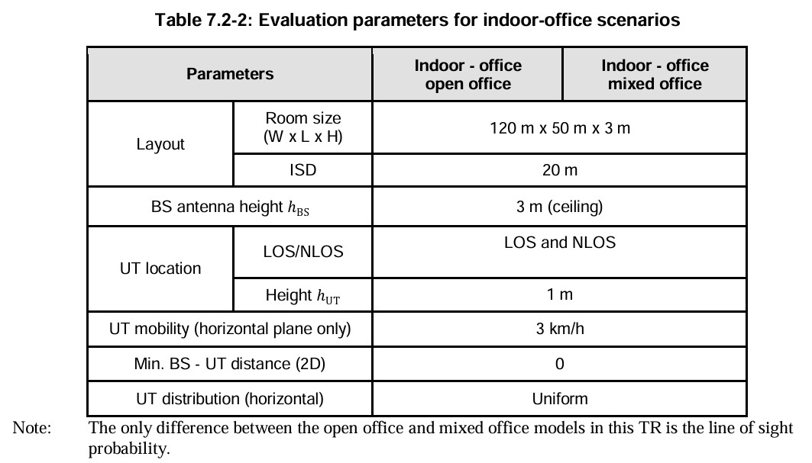
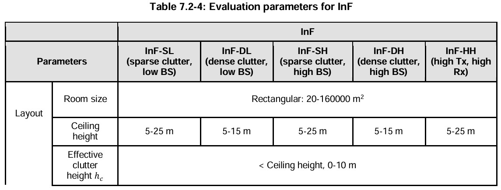
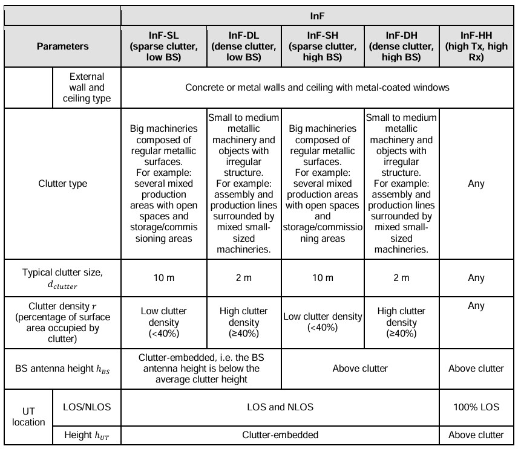

# 3GPP TR 38.901 V19.0.0 (2025-06)

## Escopo do documento

O documento tem como título "Study on channel 
model for frequêncy spectrum above 6 GHz" e trás à metodologia de avaliação
do 3GPP e modelagem de camada física tanto do equipamento móvel quanto da rede
de acesso.

O documento fala dos modelos de canal para frequências de 0,5 GHz a 100 GHz.

## Trabalhos de modelagem fora do 3GPP

### Grupos

- METIS (Mobile and wireless communications Enablers for the Twenty-twenty Information Society)
- MiWEBA (Millimetre-Wave Evolution for Backhaul and Access)
- ITU-R M
- COST2100
- IEEE 802.11
- NYU WIRELESS
- 5G mmWave Channel Model Alliance: NIST iniciated, Noth America based
- mmMAGIC (Millimetr-Wave Based Mobile Radio Access Network for Fifth Generation Integrated Communications: Europe based)
- IMT-2020 5G promotion assiciation: China based

[//]: # (### Modelos)

[//]: # ()
[//]: # (#### METIS Channel Models:)
    

## Modelos de Canal para 0.5-100 GHz

### Cenários

#### Indoor-office

#### Indoor Factory

Foca em halls de fábricas de tamanhos variados e com diferentes níveis de densidade
de "bagunça", como máquinas, linhas de montagem, prateleiras de armazenamento, etc.
Os detalhes do cenário InF estão listados na Tabela 7.2-4.

